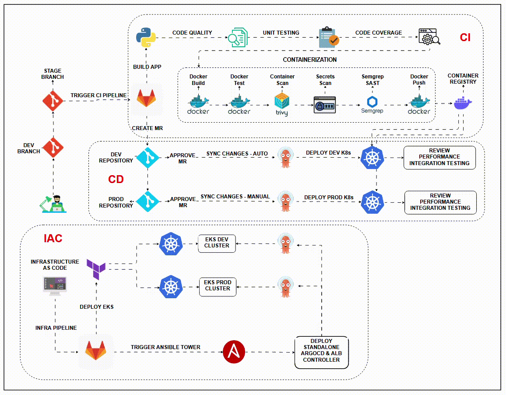
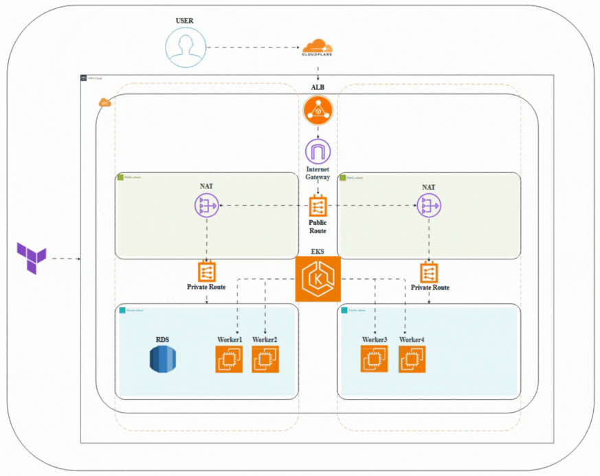

# 🌐 Ultimate Real-World DevOps Project – From Code to Scalable Cloud Infrastructure

This project simulates a complete **production-grade DevOps pipeline** that covers the entire software delivery lifecycle, with a focus on **automation, scalability, and security**. It integrates modern DevOps tools and practices such as **IaC, CI/CD, GitOps, and DevSecOps**, aligned with industry standards.

## Application Pipeline

## EKS Deployment

---

## 🚀 Project Highlights

- **Infrastructure as Code** using **Terraform** and **Ansible AWX**
- **CI/CD pipeline** using **GitLab CI**
- **Containerization** using **Docker & Kubernetes**
- **GitOps** with **ArgoCD**
- **Security & Compliance** with **Trivy, Semgrep, Ansible Vault**
- **Application Stack**: HTML, CSS, JavaScript, Django, MySQL

---

## 🔧 Infrastructure as Code (IaC)

**Provisioned via Terraform:**
- VPC with public/private subnets
- Internet Gateway, NAT Gateway
- Security Groups & Public/Private Route Tables
- Amazon EKS Cluster (private subnet)
- Amazon RDS (MySQL)
- EC2 Worker Nodes
- IAM Roles & Policies

**Configured via Ansible AWX:**
- ArgoCD (standalone mode)
- ALB Ingress Controller

---

## 📦 CI/CD Pipeline

- Built using **GitLab CI/CD**
- Multi-stage Docker builds (slim/distroless)
- CI caching for performance boost
- Artifacts for test reports and image scans
- Automated tag-based deployments

---

## 🔐 Security & Quality Gates

- Secrets management via GitLab variables, Ansible Vault, and Kubernetes Secrets
- Static analysis using **Semgrep (SAST)**
- Container image scanning using **Trivy**
- Secrets Detection using **Trivy**
- Code quality/linting enforcement

---

## ⚙️ Configuration Management & GitOps

- **Ansible AWX** deployed in local Kubeadm cluster
- Used to deploy:
  - ArgoCD in Dev & Prod EKS clusters
  - ALB Controller in Dev & Prod EKS clusters
- Integrated GitLab CI with AWX using webhooks

---

## 🚢 Application Deployment

- **Frontend**: HTML, CSS, JS
- **Backend**: Django (Python)
- **Database**: MySQL (RDS)
- Containerized using **Docker**
- Orchestrated via **Kubernetes**
- Managed deployments using **Kustomize** with environment-specific overlays

---

## 🔁 GitOps Workflow with ArgoCD

- ArgoCD pulls manifests from Gitlab Repos
- Syncs resources to respective EKS clusters using Kustomize
- Enables safe, auditable, and automated deployments to **Dev and Prod** environments

---

## 🧠 Key Outcomes

- Simulated a **real-world SaaS pipeline** which use Trunk based approach to deploy application
- Integrated critical DevOps components for **automation**, **security**, and **resilience**
- Demonstrated practical use of **Terraform**, **Ansible AWX**, **Docker**, **Kubernetes**, **GitLab CI**, and **ArgoCD**

---

## 📄 Note

This repository is for demonstration/documentation purposes only and **does not contain source code**. It is intended to showcase architectural understanding, tooling expertise, and end-to-end DevOps practices.

---

## 📫 Contact

Feel free to connect:

- **Email**: saadzahid248@gmail.com  
- **LinkedIn**: [linkedin.com/in/saad-zahid11](https://www.linkedin.com/in/saad-zahid11/)

---
